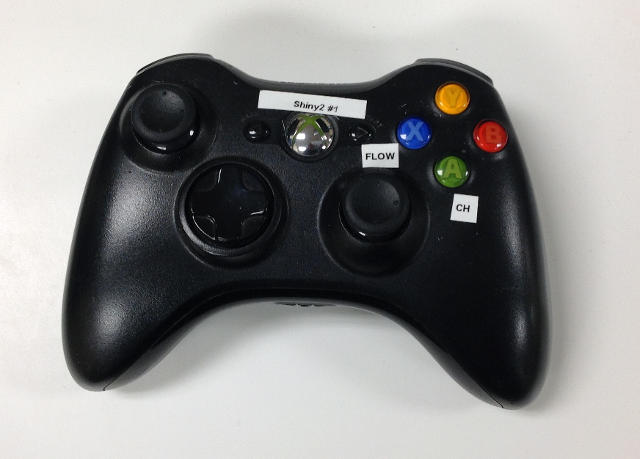

.. image:: ../_static/flatland_logo2.png
    :width: 250px
    :align: right
    :target: ../_static/flatland_logo2.png

Using a joystick
================

The purpose of the teleop_twist package is to provide a generic facility 
for tele-operating Twist-based ROS robots with a standard joystick. It is for use 
with a joystick such as the PS3 controller.

Download and install the joy software from the ROS wiki:  joy_.

.. _joy: http://wiki.ros.org/joy

Download and install the teleop_twist software from the ROS wiki:  teleop_twist_.

.. _teleop_twist: http://wiki.ros.org/teleop_twist_joy

Run the software

.. code-block:: none

    roslaunch teleop_twist_joy teleop.launch

.. note:: It is best to launch from a dedicated terminal (ties up window).

.. note:: Ctrl-c to exit.
