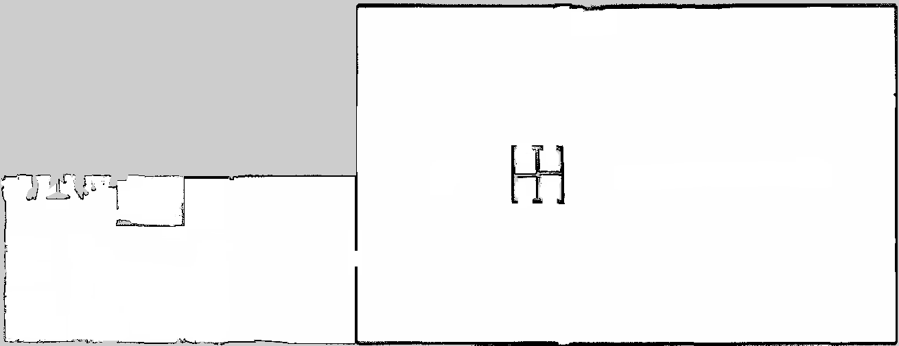

.. image:: ../_static/flatland_logo2.png
    :width: 250px
    :align: right
    :target: ../_static/flatland_logo2.png

Configuring Layers
==================
In Flatland, a layer represents the static environment features in the simulation,
they are defined by map YAML files and implemented as line segments (Box2D 
edge shapes). Layers can be loaded in two ways, either using data obtained from 
`ROS map_server <http://wiki.ros.org/map_server>`_ (an image), or directly from
a list of line segments. Examples can be found in flatland_server/tests.

From Map Server Data
--------------------
Map server yaml and image format is specified `here <http://wiki.ros.org/map_server#YAML_format>`_.
Flatland extracts line segments by first thresholding the image by the occupied_thresh
which creates a binary image, then put a line segment between two rows or columns of 
pixels where a transition from 0 to 1, or 1 to 0 occurs. Collinear lines are merged. 
Note large and noisy maps could easily results in hundreds of thousands of line segments 
which degrades performance.

An example of the YAML file is shown below. Note that the "negate" and 
"free_thresh" are not used to generate line segments. 

.. code-block:: yaml

  image: map.png                             # begin with "/" for absolute, otherwise relative w.r.t this file
  resolution: 0.050000
  origin: [-16.600000, -6.650000, 0.000000]
  negate: 0                                  # NOT used
  occupied_thresh: 0.65
  free_thresh: 0.196                         # NOT used

An example of map image is shown below.

Directly from Line Segments
---------------------------
Loading line segments directly give flexibility for users to decide how to specify
line segments that represent their environment.

To load line segments, you need need to create a line segments YAML file similar
to the map server yaml file, as well as a data file containing the actual line
segments.

An example of the line segments map YAML file is shown below. All parameters are
required.

.. code-block:: yaml

  type: line_segments        # required for indicating file type is line segments
  data: map_lines.dat        # path to line segments data file, begin with "/" for absolute, otherwise relative w.r.t this file
  scale: 0.1                 # same use as resolution in map server yaml
  origin: [-1.20, -5, 1.23]  # same use as origin in map server yaml

A Line segment data file is simply a file with each line containing a line
segment. There are four columns: x1, y1, x2, y2. (x1, y1) is the start point
of a line segment, (x2, y2) is the end point of a line segment. For example,
a line segment file with just two line segments, one from (0, 0) to (1, 1), and 
the other from (2, 3) to (-1, 2) will be as follows.

.. code-block:: text

  0    0    1    1
  2    3   -1    2
