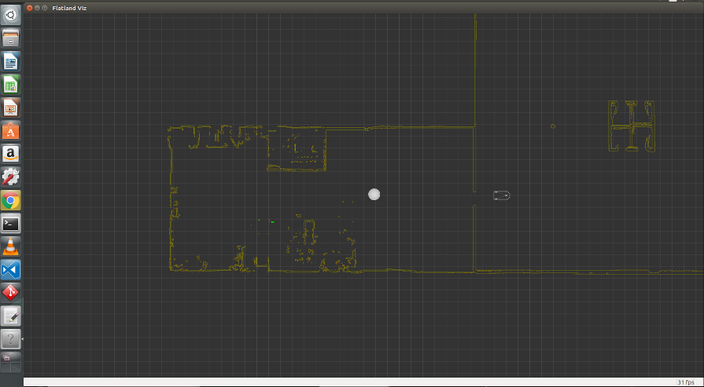
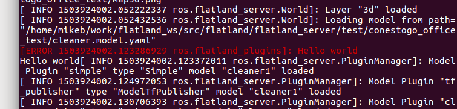

.. image:: ../_static/flatland_logo2.png
    :width: 250px
    :align: right
    :target: ../_static/flatland_logo2.png

Create Plugin Tutorial
======================

**Description:** This tutoial provides the information needed to create a plugin for use in the flatland simulator.

**Tutorial Level:** BEGINNER

With the flatland simulator, similar to Rviz, Gazebo and ROS, it is possible 
to extend the built-in functionality using plugins. A flatland simulator 
plugin is a C++ class that derives from the flatland_server::ModelPlugin 
base class.

This tutorial provides step by step instruction on how to write your own 
plugin and get it working inside the flatland simulator.
   
1. Prerequisites
----------------

The following tutorials provide a good foundation for understanding the flatland 
simulator architecture:

create_model_.

.. _create_model: file:///home/mikeb/Dev/flatland_github/src/flatland/docs/_build/html/flatland_tutorials/create_model.html

2. Getting Started
------------------

We will be creating a very simple plugin. The plugin will do one thing: print 
"Hello world" to the ROS_ERROR_STREAM. Even though the plugin itself is quite
simple, the process for getting it to function inside Flatland simulator has
many steps.

3. Install ROS
--------------

Go to the location on your harddrive you wish to install the Flatland stack. 
Create the top level of the cakin workspace:

.. code-block:: Cpp

    mkdir flatland_ws
    cd flatland_ws/

Create the source directory:

.. code-block:: Cpp

    mkdir src
    cd src

Git clone the Flatland stack:

.. code-block:: Cpp

    git clone https://github.com/avidbots/flatland.git
    cd ..
 
From inside the flatland_ws directory, build the software:
 
.. code-block:: Cpp

    catkin_make

Source the setup file:

.. code-block:: Cpp

    source devel/setup.bash

Run the Flatland simulator:

.. code-block:: Cpp

    roslaunch flatland_server server.launch

You should see a Flatland window appear:

4. Create a Flatland Plugin
---------------------------

Go to model_plugin_ for detailed instructions on how to write a plugin.

.. _model_plugin: file:///home/mikeb/Dev/flatland_github/src/flatland/docs/_build/html/core_functions/model_plugins.html

Create a new file called simple.h in the **flatland_plugins/include/flatland_plugins** directory.

.. code-block:: Cpp

    #include <flatland_server/model_plugin.h>

    #ifndef FLATLAND_PLUGINS_SIMPLE_H
    #define FLATLAND_PLUGINS_SIMPLE_H

    using namespace flatland_server;
    namespace flatland_tutorials {

    class Simple : public ModelPlugin {
    public:
    void OnInitialize(const YAML::Node &config) override;
    };
    };

    #endif

Create a new file called simple.cpp in the **flatland_plugins/src** directory.

.. code-block:: Cpp

    #include <flatland_plugins/simple.h>
    #include <pluginlib/class_list_macros.h>
    #include <ros/ros.h>

    using namespace flatland_server;
    namespace flatland_tutorials {

    void Simple::OnInitialize(const YAML::Node &config) {
    ROS_ERROR_STREAM("Hello world");
    }
    };

    PLUGINLIB_EXPORT_CLASS(flatland_tutorials::Simple, flatland_server::ModelPlugin)

5. Compiling the Plugin
-----------------------

You may need to add to the include path. Refer to the documentation for the 
specific SDK/editor you are using. 

Edit the file flatland_plugins.xml. Add the following before the closing </library> tag.

.. code-block:: Cpp

  <class type="flatland_plugins::Simple" base_class_type="flatland_server::ModelPlugin">
    <description>Simplest possible plugin to print hello world</description>
  </class>

Locate the add_library section and add the following before the closing ')' :

.. code-block:: Cpp

  src/simple.cpp

Edit the file flatland_server/test/conestogo_office_test/cleaner.model.yaml. After the line plugins: 
add the following followed by a blank line.

.. code-block:: Cpp

  - type: Simple
    name: simple
    
6. Running the Flatland simulator with installed plugin
-------------------------------------------------------

Run the Flatland simulator:

.. code-block:: Cpp

    roslaunch flatland_server server.launch    

Kill the program and look at the console output. You should see the message 
"Hello world" embedded in the output.
   

