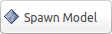

.. image:: ../_static/flatland_logo2.png
    :width: 250px
    :align: right
    :target: ../_static/flatland_logo2.png

Create Custom Robot Tutorial
============================
  

**Description:** This tutoial provides the information needed to create 
a robot from scratch for use in the flatland simulator.

**Tutorial Level:** BEGINNER

1. Prerequisites
----------------

The following tutorials provide a good foundation for understanding the flatland 
simulator architecture:

create_plugin_, create_model_

.. _create_plugin: file:///home/mikeb/Dev/flatland_github/src/flatland/docs/_build/html/flatland_tutorials/create_plugin.html

.. _create_model: file:///home/mikeb/Dev/flatland_github/src/flatland/docs/_build/html/flatland_tutorials/create_model.html

2.  Create the model Yaml file
------------------------------

Create a new Yaml file, or make a copy of an existing Yaml file as a starting place.
The Yaml files can be located anywhere, however, the usual location is within the 
Flatland simulator directory structure:

.. code-block:: none

    flatland_server/test/conestogo_office_tests

We will start with a simple custom model and increase the complexity as we go.
Edit your custom robot model file to contain the following:

.. literalinclude:: ../model1.yaml

This model has one body, of type dynamic and color white. It defines a polygonal
footprint with a density of 100. The shape is a box with corners trimmed. 

3. Configure Flatland to load your model
----------------------------------------

There are two ways to load a model into the Flatland simulator. You can load 
your model ineractively using the Spawn Model Tool |smpic| or you can configure the 
simulaor to automatically load your model on startup. 

.. note:: Any errors generated while loading a model will be sent to the console where the Flatland simulator was started.  

If you want to configure the Flatland Simulator to load your specific robot model
during startup, follow the instructions below.

Make a copy of the default world Yaml file:

.. code-block:: Yaml

    cd flatland_server/test/conestogo_office_test
    cp world.yaml custom_world.yaml

Edit your custom world yaml file and add the following:

.. code-block:: Yaml

    models:  
    - name: your_custom_model 
        pose: [0, 0, 0]
        model: "your_custom_model.yaml"    

.. note:: Delete the default model if desired.  

To run the Flatland simulator with your custom model, you must provide the 
following world_path override on the launch command:

.. code-block:: Bash

    roslaunch flatland_server server.launch world_path:=/home/mikeb/Dev/flatland_ws/src/flatland/flatland_server/test/conestogo_office_test/your_custom_world.yaml

.. warning:: You need to modify the path above to use the location of your Flatland installation. 

You should see the flatland window appear with your new custom robot at x=0, y=0.
