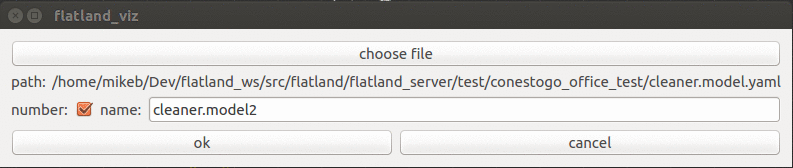

.. image:: ../_static/flatland_logo2.png
    :width: 250px
    :align: right
    :target: ../_static/flatland_logo2.png

Spawn Model Tutorial
======================
  

**Description:** This tutoial provides the information needed to spawn a model for use in the flatland simulator.

**Tutorial Level:** BEGINNER

This tutorial provides step by step instruction on how to spawn a model using the Flatland UI.

.. note:: Flatland and Rviz tools can be used interchangeably in either the Flatland or Rviz software.

1. Prerequisites
----------------

The following tutorials provide a good foundation for understanding the flatland 
simulator architecture:

create_plugin_, create_model_

.. _create_plugin: file:///home/mikeb/Dev/flatland_github/src/flatland/docs/_build/html/flatland_tutorials/create_plugin.html

.. _create_model: file:///home/mikeb/Dev/flatland_github/src/flatland/docs/_build/html/flatland_tutorials/create_model.html

2. Installation
---------------

To use the Spawn Model Tool, first it must be installed. The following animated gif shows the installation process.
First click on the + button to bring up the tool selection dialog. Next choose the Spawn model tool from the available tools.
Finally, click the ok button to confirm your selection. A new button |smpic| appears on the right side of the toolbar.

.. image:: https://media.giphy.com/media/3ohhwCy9VBsZ4Q1tYc/giphy.gif
    :width: 650px
    :target: https://media.giphy.com/media/3ohhwCy9VBsZ4Q1tYc/giphy.gif

.. warning:: If the Flatland window is too small, some of the tools might not be visible.

3. Usage
--------

To spawn a model begin by clicking the spawn model tool button |smpic| in the toolbar at the top of 
the Flatland window. The spawn model popup dialog appears. The spawn model tool must be provided
with a valid Flatland model file in Yaml format. 

.. |smpic| image:: ../_static/spawn_model_button.png
    :width: 15%

.. image:: https://media.giphy.com/media/3o7aD9ZDpsmoZDfq5a/giphy.gif
    :width: 650px
    :target: https://media.giphy.com/media/3o7aD9ZDpsmoZDfq5a/giphy.gif

4. Number checkbox
------------------

The number checkbox enables automatically appending the model name with a number 
that increases by one each time. This ensures each model name will always be unique.
It is a good idea to turn this on if you intend to spawn more than one occurance 
of the same model.

5. Name text field
------------------

The name text field recieves the file name of the file chosen using 
the file selection dialog (with the path removed). You can choose to override
this name with a name of your choosing.

.. image:: https://media.giphy.com/media/l1J9t3dYwC3IqPiyQ/giphy.gif
    :width: 650px
    :target: https://media.giphy.com/media/l1J9t3dYwC3IqPiyQ/giphy.gif

6. Placing and rotating model
-----------------------------

There are three sequential phases to spawning a model. 
The menu, translation and the rotation. When you click on the spawn model button |smpic|
you enter the menu phase. During this phase you can change the model name.

When ready to proceed, click the ok button. You are now in the translation phase.
The dialog disappers and your 2D model appears attached to the cursor. Move the 
cursor to the location on the floor where you want to place your  model. Left
click to place the model and enter the rotation phase.

During the rotation phase, the model remains pinned to one location on the floor, 
however it will rotate to point at the cursor. Move the cursor in a circle 
around your model until it is pointing in the desrired direction. Left click to exit
the spawn model tool. The model will appear in the Flatland world at the desrired
position and orientation.

.. image:: https://media.giphy.com/media/3ohhwBsRwvPcNUZEyI/giphy.gif
    :width: 650px
    :target: https://media.giphy.com/media/3ohhwBsRwvPcNUZEyI/giphy.gif

