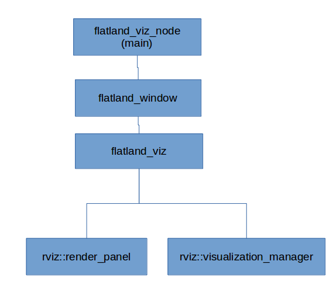

.. image:: _static/flatland_logo2.png
    :width: 250px
    :align: right
    :target: _static/flatland_logo2.png

Flatland Simulator Overview
===========================

This document provides an overview of Flatland Simulator.

Flatland Simulator is a light weight, performance centric 2D robot simulator. It
is built to integrate directly with ROS and uses Box2D for physics simulation.
This project is divided into four ROS packages: flatland_server, flatland_plugins,
and flatland_viz, and flatland messages.

Flatland Server
---------------
Flatland server contains the core functionalities of Flatland Simulator
including simulation environment, objects, plugin interfaces, and ROS services.
All of flatland server runs in a single ROS node, in a single thread. The 
following are some of the commonly used terminologies in the Flatland Server.

* **Simulation Manager**: Simulation manager is responsible for managing the
  state of the simulator. It manages how the world progresses through time,
  as well ROS Services to interact with the simulation.

* **World**: World is everything that lives in the simulation, including the 
  layers, models, time, and other physical properties. It also manages the plugins.

* **Layer**: Layer represents the static environment features in the simulation
  such as walls in a building. It allows large scale static features to be loaded
  and represented in an efficient manner. Flatland allows a powerful feature where
  multiple layers can be used to represent what is effectively a 2.5D world. 

* **Model**: Models are collection of bodies. It can be used to represent any 
  physical entities, such as robots, people, automatic doors, or chairs.

* **Body**: A body is a indeformable and inseparable piece of entity. A body does
  not need to contiguous, the actual physical outlines are defined by a collection
  of footprints. Body manages physical states such as position and velocity.
  The concept is equivalent to a Body in Box2D physics engine.

* **Footprint**: A footprint defines the actual physical size, shape, 
  and material properties. It manages physical properties such as density and 
  friction. It is contiguous.  The concept is equivalent to a Fixture in Box2D
  physics engine.

* **Joint**: A joint is used to connect two pieces of bodies. It defines additional
  constraints on how the two bodies must interact with each other. The concept is
  equivalent to a Joint in Box2D physics engine.

* **Pose**: Pose is always the x, y, and angle of an object

* **Origin**: Origin is the position and orientation of the coordinate system

Flatland Plugins
----------------
Flatland Plugins contains the useful plugins that were developed for use with the flatland
2D simulator. 

Flatland Visualization
----------------------
Flatland Visualization contains the visualization portion of 2D simulator. Visualization
in flatland is completely ROS based. Once the visualization option is turned on,
the 2D simulator would convert the models and layers to ROS markers messages and
publish them through ROS topics. Thus, flatland visualization can also be viewed
directly on rviz, however the user needs to manually subscribe to topics, whereas
flatland_viz is written to automatically show visualization for models and layers
in the simulation.

Flatland Messages
-----------------
The package flatland_msgs defines ROS messages and services used by the Flatland
Simulator.

Software Architecture
---------------------

The following figure shows the top level software architecture. The architecture 
closely resembles the Rviz top level software architecture.

Build
-----

The software uses CMakeFiles and a catkin workspace. To build: cd to the root of the 
catkin workspace and type catkin_make.